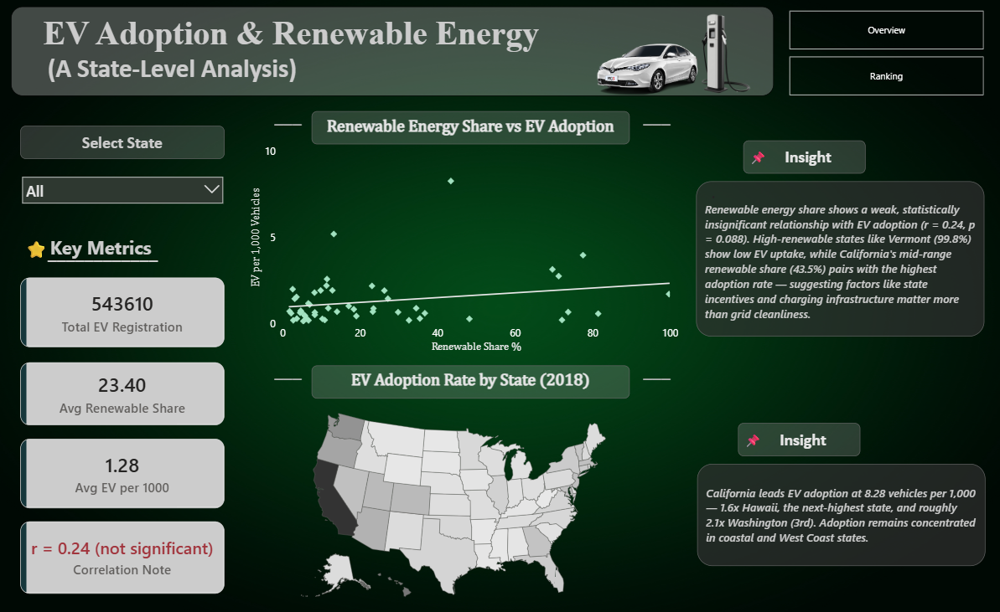
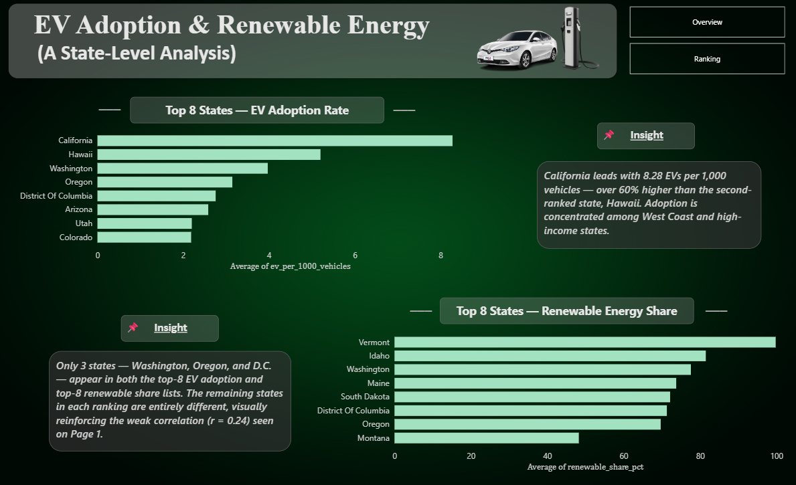

# ⚡ EV Adoption & Renewable Energy Analysis
> **Statistical Analysis + Interactive Power BI Dashboard**  
> Testing whether cleaner electricity grids actually predict higher EV adoption across US states.
---
## 📌 Project Overview
This project analyzes **EV registrations across 50 US states + DC** alongside **30 years of energy generation data (1990–2019)** to test a widely assumed relationship: that states with cleaner grids adopt EVs at higher rates. The findings are translated into a **2-page interactive Power BI dashboard** built for policy and stakeholder decision-making.

The analysis answers real stakeholder questions:
- Does renewable energy share actually predict EV adoption?
- Which states are genuinely leading the clean energy transition — and are they the same states leading in EVs?
- What role does state policy play compared to grid composition?
- Where should EV infrastructure investment be prioritized?
---
## 💡 Key Insights
- 📉 **Renewable energy share does NOT predict EV adoption** — correlation is weak and statistically insignificant (r = 0.24, p = 0.088), disproving the common "clean grid = EV state" assumption.
- 🥇 **California leads EV adoption at 8.28 per 1,000 vehicles** — 1.6x Hawaii (2nd) and ~2.1x Washington (3rd) — despite a moderate 43.5% renewable share.
- 🌬️ **Renewable growth is a Midwest wind story** — Kansas, Iowa & Oklahoma jumped to 35%+ renewable share since 1990, none of which rank in the top 8 for EV adoption.
- 🏛️ **Policy beats infrastructure** — top EV-adoption states share ZEV mandates and purchase incentives (CA + 9-state coalition), not clean electricity grids.
- 🔋 **National renewable share nearly doubled** — 9% (1990) → 17% (2018), with the steepest growth after 2015.

## 📊 Dashboard Preview
### Page 1 — Overview

### Page 2 — Ranking


## 🛠️ Tools & Technologies
| Tool | Usage |
|------|-------|
| Python | Data cleaning, EDA |
| Pandas | Data manipulation & merging |
| Matplotlib & Seaborn | Data visualization |
| SciPy | Correlation & statistical significance testing |
| Power BI | Interactive dashboard |
---
## 📁 Project Structure
```
EV-ADOPTION-RENEWABLE-ENERGY/
│
├── ev_adoption_analysis.ipynb          ← Full analysis notebook
├── States_Electric_Vehicle_Registrations_2018.xlsx   ← Raw dataset
├── States_All_Vehicle_Registrations_2018.xlsx        ← Raw dataset
├── States_Annual_Energy_Generation_Sources_1990_2019.xlsx  ← Raw dataset
├── state_codes.xlsx                    ← State reference dataset
├── master_2018.csv                     ← Cleaned & merged dataset
├── EV_Renewable_Energy_Analysis_Report.pdf   ← Full analysis report
│
└── dashboard/
    ├── EV_Renewable_Dashboard.pbix     ← Power BI dashboard
    ├── dashboard1.png                  ← Overview screenshot
    └── dashboard2.png                  ← Ranking screenshot
```
---
## 📈 Analysis Steps Covered
1. Importing & Inspecting 4 Raw Datasets
2. Data Cleaning (state name standardization, header parsing, producer-type filtering)
3. Merging into a Master Dataset (51/51 states matched, zero nulls)
4. Exploratory Data Analysis (distributions, summary stats)
5. Correlation Analysis (Pearson r + statistical significance testing)
6. Time Series Analysis (national & state-level renewable growth, 1990–2018)
7. Geospatial Analysis (state-level EV adoption & renewable share mapping)
8. Policy Context Assessment
9. Conclusion & Recommendations
---
## 🔍 Dataset Info
- **Source:** U.S. vehicle registration & energy generation records
- **Coverage:** 50 states + Washington D.C.
- **Time range:** 2018 (registrations), 1990–2019 (energy generation)
- **Key columns:** `state_name`, `ev_registrations`, `total_vehicles`, `renewable_share_pct`, `ev_per_1000_vehicles`
---
## 👤 Author
**Mayank Bhardwaj**  
Aspiring Data Analyst | BCA 2026 | Manipal University Jaipur  
[](https://github.com/mynkbhardwaj87007-spec/ev_adoption_analysis)  
[](https://www.linkedin.com/in/mayank-bhardwaj-87b36835b/)
---
*⭐ If you found this project helpful, consider giving it a star!*
